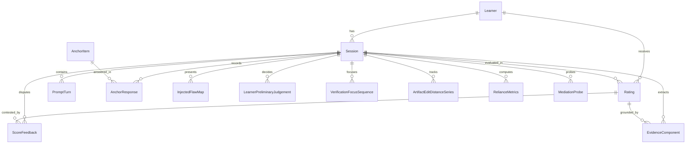

# System Architecture & Data Model

本書は、Enishio アセスメントエンジン プロトタイプにおける**システム全体構成、データモデル、およびセキュリティ・データ整合性境界**を定義した正本仕様書である。

---

## 1. システム全体構成 (System Architecture)

本システムは、受講者が生成AIと対話しながら実務課題を解決するプロセスから、**「動的コンピテンシー（AI協働検証力・トレードオフ言語化力）」**を客観的に抽出・測定するWebプラットフォームである。

```
┌────────────────────────────────────────────────────────────────────────┐
│                          Next.js App Router                            │
│  ┌─────────────────────────────┐    ┌───────────────────────────────┐  │
│  │   UI Layer ("use client")   │    │   API Layer (Route Handlers)  │  │
│  │  - Session Orchestration    │    │  - Session & Telemetry        │  │
│  │  - 3-Pane Dynamic Dialogue  │───>│  - Dynamic Task & Flaws (Svr) │  │
│  │  - Viability Mocks          │    │  - 2-Stage AutoSCORE          │  │
│  └─────────────────────────────┘    │  - Socratic Mediator          │  │
│                                     └──────────────┬────────────────┘  │
└────────────────────────────────────────────────────┼───────────────────┘
                                                     │
                             ┌───────────────────────┴───────────────────────┐
                             │                                               │
                             ▼                                               ▼
               ┌───────────────────────────┐                   ┌───────────────────────────┐
               │    PostgreSQL Database    │                   │   OpenAI API (GPT-5/4o)   │
               │  - 12 Prisma Models       │                   │  - Stage 1: Evidence Ext. │
               │  - Telemetry & Logs       │                   │  - Stage 2: Band Scoring  │
               │  - Audit Trails           │                   │  - Socratic Probe Move    │
               └───────────────────────────┘                   └───────────────────────────┘
```

### 1.1 技術スタック
* **フロントエンド / バックエンド**: Next.js 16 (App Router), React 19, TypeScript
* **データベース**: PostgreSQL (Docker Compose 運用可能)
* **ORM**: Prisma 5.22
* **LLM プロバイダー**: OpenAI API (`gpt-5.6-luna` または環境変数 `EVALUATOR_MODEL`) / Structured Outputs via Zod
* **スタイリング**: Tailwind CSS, Lucide React

---

## 2. データモデル仕様 (Prisma 12 Models)

本プロトタイプの DB スキーマ（`prisma/schema.prisma`）は、MVP 定義書 4.1.1 の仕様に完全準拠しており、以下の12モデルで構成される。

### 2.1 エンティティ関係図 (ER Diagram)



### 2.2 モデル一覧と責務

| モデル名 | マッピング | 役割と責務 |
| :--- | :--- | :--- |
| **`Learner`** | `learners` | 受講者エンティティ。`uuidv5` による決定論的 ID。 |
| **`Session`** | `sessions` | 演習セッション。受講者ごとの連番 `session_seq` を一意に管理。`window_blur_duration_sec`（画面外離脱時間）を記録。 |
| **`Rating`** | `ratings` | 軸4（前提・トレードオフの言語化力）等の能力評定（Band 0..5）。確信度（`scoring_confidence`）、採点者種別（`rater_type`）、用途（`stakes_context`）を保持。 |
| **`AnchorItem`** | `anchor_items` | 共通アンカー課題バンク（系統A/B、ステータス：pretest/operational/verification/retired）。 |
| **`AnchorResponse`** | `anchor_responses` | アンカー設問への受講者回答。v1（選択式）および v2（4段構成：段階1採用可否、段階2懸念領域、段階3判断移動、段階3'迎合検証）を記録。 |
| **`PromptTurn`** | `prompt_turns` | 対話ログ（`user` / `assistant` / `system` / `mediator`）。メディエーターはAI同僚と明示的にロールを分離。 |
| **`ArtifactEditDistanceSeries`** | `artifact_edit_distance_series` | 成果物コードのレーベンシュタイン編集距離の時系列追跡。 |
| **`InjectedFlawMap`** | `injected_flaw_map` | セッションに提示された仕込み不備（`is_flaw=true`）および正常箇所（`is_flaw=false`）の基準マップ。 |
| **`LearnerPreliminaryJudgement`** | `learner_preliminary_judgements` | CFF（認知先行判断）。AI評価閲覧前に受講者が下す採択/差し戻し（`approve`/`remand`）と必須理由記述（`justification`）。 |
| **`VerificationFocusSequence`** | `verification_focus_sequences` | 受講者が検証中にハイライト・着目したコード行・テキストの順序付き追跡。 |
| **`EvidenceComponent`** | `evidence_components` | 採点第1エージェントが対話ログから抽出した構造化根拠要素（スパン、類型、接地、仕込み不備ID）。 |
| **`RelianceMetrics`** | `reliance_metrics` | 適正依存3指標（CSR: 正当自立率、CAR: 正当AI依存率、オートメーションバイアス指数）。 |
| **`MediationProbe`** | `mediation_probes` | ソクラテス型深掘り・What-if注入の手（`probe_move`）、状態推定（`state_estimate`）、選定理由。 |

---

## 3. 重要アーキテクチャ境界とデータ整合性

### 3.1 決定論的受講者ID (`generateLearnerId`)
* テナント隔離と個人情報保護のため、平文のユーザーIDを直接格納しない。
* 標準ネームスペース（`6ba7b810-9dad-11d1-80b4-00c04fd430c8`）を用いた `uuidv5(tenantNamespace + ":" + rawUserId)` により、衝突のない一意な ID を導出する。

### 3.2 セッション連番の排他制御 (`startSession`)
* `(learner_id, session_seq)` に複合ユニーク制約が存在する。
* 同時リクエストによる競合が発生した場合は、Prisma P2002 エラーを検知して最大5回まで安全にリトライし、連番の歯抜けや重複を防ぐ。

### 3.3 ステークスコンテキスト (`stakes_context`)
* すべての評価（`Rating`）およびアンカー応答（`AnchorResponse`）に、以下の用途列挙（`[D-67]`）を不変記録する:
  * `"formative"`: Phase 1 育成・非連動
  * `"education"`: Phase 2 教育
  * `"promotion"`: Phase 3(C) 昇格・配置
  * `"selection"`: Phase 3(A) 採用選考
  * `"verification"`: 可搬型の照合
* 用途からステークス水準への一方向写像のみを許容し、事後分離性を担保する。

### 3.4 画面外滞在時間 (`window_blur_duration_sec`)
* クライアントの `blur` イベントを集計するが、**本プロトタイプにおける採点・保留判定・レポートには一切使用しない**（記録のみ）。
