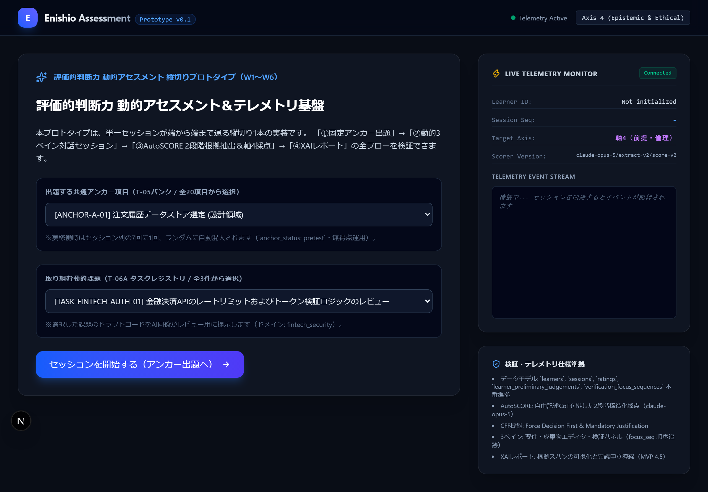
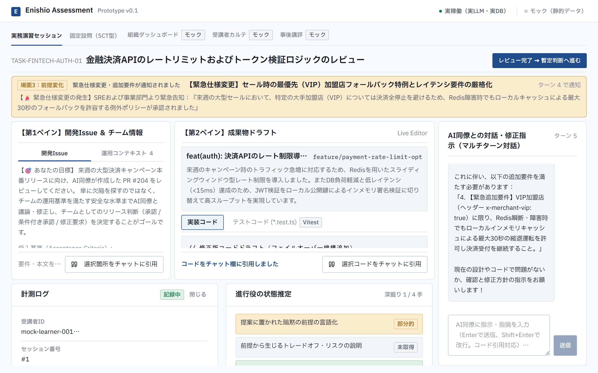
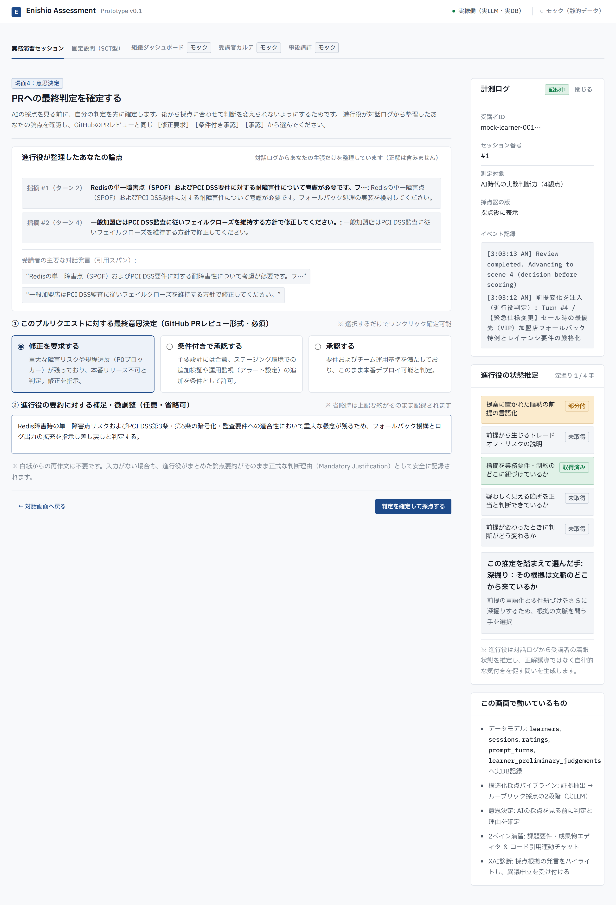
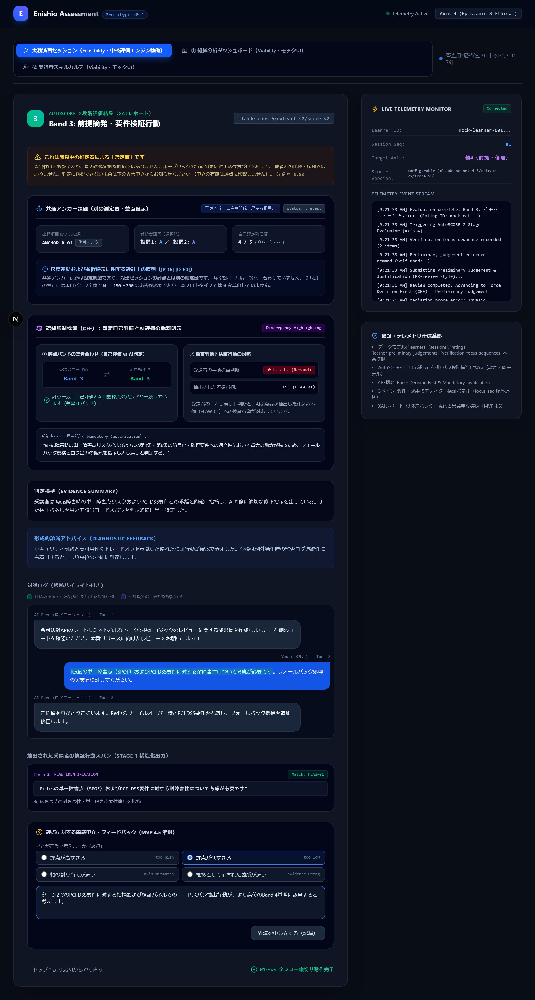

# Enishio Assessment Prototype

[](https://github.com/ryosuzaki/enishio-assessment-prototype/actions/workflows/ci.yml)

**AI時代の実務判断力**（動的で不確実な状況下において、AIを含む情報やプロセスを多角的に吟味し、自己の思考を省察・適応させながら、責任を持って課題解決や価値創出を主導する能力）を、AIとの実務演習を通じて測り、育てる B2B SaaS のプロトタイプです。IPA 未踏アドバンスト事業（2026年度下期）への提案に合わせて公開しています。

提案の中核である**共通尺度化エンジン**（出題が受講者ごとに変わっても結果を比べられるようにする2層の仕組み）は、事業期間中に実装します。このリポジトリにあるのは、その入力になる「1回の演習セッション」と、第2層の外部基準である「固定設問」の実装です。

---

## 1. 何が動いていて、どこがモックか

| 画面・機能 | 状態 | 概要 |
| :--- | :--- | :--- |
| **実務演習セッション** | **実稼働（実LLM・実DB）** | 課題提示 → 検証対話 → 前提変化の自動注入 → 採点前の意思決定 → 構造化採点パイプライン（2段階） → XAI診断 |
| **固定設問（SCT型）** | **出題と回答記録まで実稼働** | 全受講者が同じ条件で解く、LLMを通さない外部基準。公開用サンプル3問を同梱。採点は専門家パネルの組成後（いまはダミー分布のため得点化しない） |
| **組織ダッシュボード** | モック | 組織全体の成長推移、AIの出力を鵜呑みにした率の改善（静的データ） |
| **受講者カルテ** | モック | 4観点のレーダーチャート、AIへの依存傾向、好手ログ |
| **事後講評** | モック | AIが仕掛けた誤りの構造、上位者の攻略ルートとの比較 |

提案書の「共通尺度化エンジン」のうち、未実装の部分は次のとおりです。

| 提案書の構成要素 | このリポジトリでの状態 |
| :--- | :--- |
| 第1層 (1) 構造化採点パイプラインによる証拠の抽出 | 実装済み（2段階採点の第1段） |
| 第1層 (2) LLM判定器による証拠の一対比較 | 事業期間中に実装（統計的な仕組みは合成データで検証済み、下記） |
| 第1層 (3) Bradley-Terry モデルによる共通尺度の推定 | 推定器は実装済み（[src/lib/equating/](src/lib/equating/)）。実データへの接続は事業期間中 |
| 第2層 (1) 固定設問（SCT型）の出題と記録 | 実装済み（採点は専門家パネル組成後） |
| 第2層 (2) 人間専門家の凍結ペア判定との突合 | 事業期間中に実装 |

### 1.1 共通尺度化エンジンの合成データ検証

実データで実装する前に、2層の仕組みが統計的に筋が通っているかを合成データで確かめています（LLM API は使わず、`npm run sim:equating` で誰でも再現できます）。詳細は **[docs/equating-simulation/](docs/equating-simulation/README.md)** にあります。


- **第1層**：受講者ごとに課題の難易度が違うとき、1人10回の一対比較＋Bradley-Terry は、判定器が難易度の影響を取り除けるなら真の実力との順位相関 0.87（絶対採点は 0.54）。ただし判定器が難易度の影響を絶対採点と同じだけ受けると差はほぼ消える。成否はこの一点にかかっているので、事業期間中に人間専門家の判定との一致率で実測する。
- **第2層**：「受講者が伸びた」のか「判定器がズレた」のかは、第1層と固定設問の伸びの食い違いで見分けられた。一方、凍結ペアを無作為に100組選ぶだけではズレをほとんど検出できず、中身が同じで表層特徴だけが違う対照ペアを30組混ぜると明確に検出できた。凍結データはこの形で設計する。

これは仕組みの検証で、LLM 判定器が実際にこの仮定を満たすことを示すものではありません。

---

## 2. 画面と演習の流れ

画面上部のタブで5つの画面を切り替えます。モックの画面にはタブと画面の両方に「モック」と表示しています。

### 2.1 実務演習セッション

受講者がAI同僚と一緒にPRをレビューし、途中で入る仕様変更に対応し、自分の判定を確定させてから、根拠つきの診断を受け取る一連の流れです。

| 場面 | 名称 | 受講者の体験 |
| :--- | :--- | :--- |
| **1** | **課題提示** | 実務課題（決済セキュリティ／在庫の並行処理／チケット自動割当）を選び、PRの仕様書や障害ログを精査する。 |
| **2** | **検証対話** | AI同僚の反論や過剰指摘に対し、仕様や規程を根拠に検証・是正する。進行役は対話ログから「まだ引き出せていない根拠」を推定して深掘りの問いを出す（正解は知らされていない）。 |
| **3** | **前提変化** | 初期方針が固まった時点で、進行役が緊急の仕様変更を自動で注入する。当初方針に固執せず方針を組み直せるかを見る。 |
| **4** | **意思決定** | AIの採点を見る前に、GitHubのPRレビューと同じ［修正要求］［条件付き承認］［承認］から判定と理由を確定する。 |
| **5** | **XAI診断** | 対話ログから検証行動を抽出し（第1段）、その証拠だけを入力にルーブリックで採点する（第2段）。採点根拠の発言をハイライトし、異議申立を受け付ける。確信度が足りないときは評点を確定せず人間の確認待ちにする。 |

#### 主要画面

> スクリーンショットは再現性のため、API応答を固定したブラウザテスト（`npm run capture:screenshots`）で撮影しています。実LLMでの動作は、`.env` にAPIキーを設定して起動すると確認できます。

**初期画面**：演習の流れと課題の選択。


**検証対話と前提変化**：上段に業務要件とコード、下段にAI同僚との対話。右列は計測ログと、進行役の状態推定。


**意思決定**：進行役が対話ログから整理した論点を見ながら、採点前に判定と理由を確定する。


**XAI診断**：評点、判定根拠、次に伸ばすところ、根拠ハイライト付きの対話ログ、異議申立。


### 2.2 その他の画面

* **固定設問（SCT型）**：医学教育の臨床推論評価で使われる SCT を IT 向けに組み直した設問。「全体判断 → 懸念の所在 → 前提変化での判断更新 → 反論への応答」を1段ずつ開示する（[画面](docs/screenshots/02-anchor-question.png)）。
* **組織ダッシュボード（モック）**：メンバー別の受講進捗、4観点の推移、AIの出力を鵜呑みにした率の改善（[画面](docs/screenshots/07-organization-dashboard.png)）。
* **受講者カルテ（モック）**：4観点12項目のレーダーチャート、AIへの依存傾向、好手ログ（[画面](docs/screenshots/08-learner-profile.png)）。
* **事後講評（モック）**：AIが仕掛けた誤りの構造、上位者の攻略ルートとの比較（[画面](docs/screenshots/09-benchmark-gallery.png)）。

---

## 3. クイックスタート

リポジトリをクローン後、以下の手順ですぐにローカル起動できます。公開デモ用のサンプル設問が同梱されているため、クローン直後から全画面を体験可能です。

```bash
npm install
cp .env.example .env      # DATABASE_URL は docker-compose の設定と一致
docker compose up -d      # ローカル PostgreSQL（外部 DB を使うなら不要）
npm run prisma:generate && npm run prisma:push
npm run seed:anchors      # 固定設問のサンプルを投入
npm run dev
```

> 💡 **LLM APIキーの設定について**:  
> `.env` に `OPENAI_API_KEY` を設定すると、AI同僚との対話・2段階採点・XAI診断まで実LLMで動きます。APIキーが無くても、モック画面の閲覧と固定設問の出題・記録は動きます（採点だけはキーワード一致などで代用せず、エラーを返します）。

操作手順の詳細やテレメトリの確認項目は [プロトタイプ動作確認手順書](docs/プロトタイプ動作確認手順書.md) を参照してください。

---

## 4. 主なコマンド

```bash
npm run dev                   # 開発サーバー起動 (http://localhost:3000)
npm run test                  # 単体テスト（Vitest 257件・APIキー/DB不要）
npm run test:integration      # 結合テスト（Vitest 20件・実PostgreSQLを使用）
npm run test:e2e              # E2Eテスト（Playwright 11シナリオ）
npm run capture:screenshots   # UIスクリーンショット自動取得（docs/screenshots/ へ高解像度出力）
npm run check:flaw-detection  # 代行無効化チェック（Claude / Gemini マルチプロバイダ実測）
npm run check:no-leak         # クライアントバンドルへの正答鍵・秘密情報非漏洩チェック
npm run sim:equating          # 共通尺度化エンジンの合成データ検証（LLM/DB不要、docs/equating-simulation/ へ出力）
```

---

## 5. 技術スタック

* **Frontend**: Next.js 16（App Router）、React 19、Tailwind CSS v4、Lucide React
* **Backend**: Next.js Route Handlers、TypeScript、Zod
* **Database**: PostgreSQL、Prisma ORM
* **LLM**: OpenAI API（既定: `gpt-5.6-luna`）、Anthropic / Google GenAI SDK（検証用）
* **Testing**: Vitest、Playwright

---

## 6. 関連ドキュメント

アーキテクチャ詳細、データモデル、設計上の判断、開発規律については、以下の仕様書およびドキュメントを参照してください。

* **[仕様書正本トップ（Living Spec）](specs/README.md)**: システム全体構成、全16モデルER図、フィーチャー仕様一覧（001/002/003）、専門用語の定義、テスト不変条件
* **[プロジェクト憲法（不可侵原則）](.specify/memory/constitution.md)**: 2層分離（Feasibility / Viability）、正答鍵非漏洩、フォールバック採点禁止などの基本原則
* **[プロトタイプ動作確認手順書](docs/プロトタイプ動作確認手順書.md)**: ステップごとの詳細操作手順、テレメトリ確認項目、公開デプロイ手順、トラブルシューティング
* **[開発者向け仕様書駆動開発ガイド](docs/開発者向け仕様書駆動開発ガイド.md)**: SDD（仕様書駆動開発）サイクルと開発規律

---

## ライセンス

All rights reserved. 事業化を予定しているため OSS ライセンスは付していません。閲覧のみ可。
