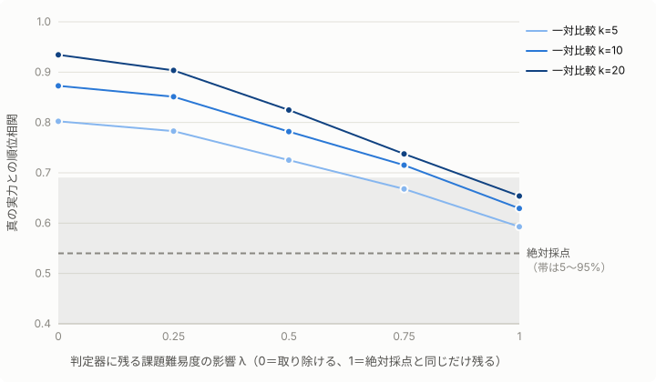

# 共通尺度化エンジンの合成データ検証

> このファイルは `npm run sim:equating`（[scripts/simulate-equating.ts](../../scripts/simulate-equating.ts)）が生成しています。手で編集しないでください。
> 仕様: [specs/004-equating-simulation/spec.md](../../specs/004-equating-simulation/spec.md)／実装: [src/lib/equating/](../../src/lib/equating/)

提案の中核である共通尺度化エンジン（第1層：証拠の一対比較＋Bradley-Terry、第2層：固定設問と凍結ペア判定による定点較正）が、**統計的な仕組みとして筋が通っているか**を、合成データで確かめたものです。LLM API は呼んでいません。

**この検証が示さないこと**：LLM 判定器が実際に下の仮定を満たすかどうかは示しません。特に実験1の λ（一対比較の判定器が課題難易度の影響をどこまで取り除けるか）は、事業期間中に人間専門家の判定との一致率で実測する対象です。ここでの数値を、到達目標の達成見込みとしては使いません。

数値はいずれも反復の平均で、括弧内は 5〜95% の範囲です。

---

## 実験1：受講者ごとに課題の難易度が違うとき、どちらが実力を回復できるか

受講者 60 名が、それぞれ自分だけの課題（難易度はばらばら、共有なし）を解いた状況をつくり、次の2つで並べて真の実力との順位相関を比べました（各条件 200 回反復）。

- **絶対採点**：自分の課題の出来を 0〜5 のバンドで採点する。課題が易しければ高く、難しければ低く出る。
- **一対比較＋Bradley-Terry**：他の受講者の証拠と見比べて勝敗を判定し、勝敗の網から能力値を推定する。1人あたり k 回比較する。

| λ | 絶対採点 | 一対比較 k=5 | 一対比較 k=10 | 一対比較 k=20 |
| :-- | :-- | :-- | :-- | :-- |
| 0 | 0.53（0.34〜0.69） | 0.80（0.71〜0.87） | 0.87（0.81〜0.92） | 0.93（0.91〜0.96） |
| 0.25 | 0.54（0.38〜0.69） | 0.78（0.70〜0.85） | 0.85（0.78〜0.91） | 0.90（0.86〜0.93） |
| 0.5 | 0.54（0.40〜0.68） | 0.73（0.62〜0.82） | 0.78（0.69〜0.86） | 0.82（0.73〜0.89） |
| 0.75 | 0.56（0.42〜0.69） | 0.67（0.57〜0.78） | 0.72（0.61〜0.81） | 0.74（0.62〜0.83） |
| 1 | 0.54（0.40〜0.67） | 0.59（0.46〜0.72） | 0.63（0.46〜0.75） | 0.65（0.51〜0.76） |

**読み取れること**

- 判定器が課題難易度の影響を取り除けるほど（λ が小さいほど）、一対比較＋Bradley-Terry は絶対採点より実力をよく回復する。1人10回の比較で、λ=0 なら 0.87、絶対採点は 0.54。
- λ=1（判定器が難易度の影響を絶対採点と同じだけ受ける）では、比較を増やしても差はほとんど残らない。**一対比較にするだけで難易度の問題が解けるわけではなく、成否は λ にかかっている。**
- したがって事業期間中に実測すべきは、判定器が難易度の違う課題の証拠をどこまで公平に見比べられるか（λ に当たる量）である。提案書の到達目標「一対比較の勝敗判定が実務専門家の優劣判断と75%以上合致するか」は、この量を人間基準で測るものに当たる。

---

## 実験2：「受講者が伸びた」のか「判定器がズレた」のかを切り分けられるか

基準期のコホートAと次期のコホートB（各 60 名）を置き、3つのシナリオを比べました（各 500 回反復）。コホートBは、実力とは関係なく文章量などの表層特徴が強い（新しいAIツールで書くと長くなる、といった状況）と仮定しています。判定器の「ズレ」は、版が変わった判定器がこの表層特徴にも重みを置き始めることで表します。

- **第1層**：コホートA内の比較は基準期の判定器で済んでおり、コホートB内とA–B間の比較はいまの判定器で行う。A・Bを結合して Bradley-Terry で推定し、Bの平均がAよりどれだけ高いかを見る。
- **第2層(1) 固定設問**：LLM を通さずに採点する。Bの平均がAよりどれだけ高いかを見る。
- **第2層(2) 凍結ペア**：コホートAから無作為に選んだ 100 組を人間専門家が判定して保存しておき、いまの判定器で再判定して一致率の変化を見る。
- **対照ペア（凍結ペアの工夫）**：同じ証拠の原文と、中身を変えずに表層特徴だけを強めた版の組を 30 組混ぜる。健全な判定器なら、表層特徴の強い側を選ぶ率は 50% 前後になる。

「伸び」はコホートAの標準偏差を単位にしています（真の伸びは (a)(c) で 0.5、(b) で 0）。

| シナリオ | 第1層が示す伸び | 固定設問が示す伸び | 食い違い（第1層 − 固定設問） | 凍結ペアの一致率の変化 | 対照ペアで表層特徴の強い側を選んだ率 |
| :-- | :-- | :-- | :-- | :-- | :-- |
| (a) 実力が上がった（判定器は同じ） | 0.43（0.15〜0.70） | 0.44（0.16〜0.74） | -0.01（-0.22〜0.21） | 0.00（-0.09〜0.09） | 0.50（0.37〜0.63） |
| (b) 判定器の版が変わってズレた（実力は同じ） | 0.48（0.16〜0.82） | 0.01（-0.27〜0.30） | 0.47（0.22〜0.73） | -0.03（-0.12〜0.06） | 0.88（0.77〜0.97） |
| (c) 両方が同時に起きた | 0.87（0.55〜1.18） | 0.43（0.09〜0.77） | 0.44（0.16〜0.73） | -0.03（-0.11〜0.06） | 0.88（0.77〜0.97） |

**読み取れること**

- (a) では第1層と固定設問の伸びが揃い、食い違いは 0 前後。(b) では第1層だけが伸びを示し、固定設問は動かない。**2つの食い違いが「判定器がズレた」ことの信号になる**（提案書 ②4 の「固定設問の得点が変わっていないのに第1層のスコアだけが動いていれば、判定器がズレたと見抜ける」に当たる）。(c) では固定設問が本当の伸びを示し、食い違いがズレの分を示す。
- 一方、**凍結ペアを無作為に 100 組選ぶだけでは、この大きさのズレはほとんど検出できない**（一致率の変化の範囲が 0 をまたぐ）。表層特徴の違いが勝敗を左右するペアが少ないためである。
- 中身が同じで表層特徴だけが違う**対照ペアを 30 組混ぜると、ズレははっきり検出できる**。凍結ペアは無作為抽出だけでなく、想定されるバイアス（文章量、流暢さ、提示順など）ごとの対照ペアを含めて設計する必要がある。これは事業期間中の凍結データ設計に反映する。

---

## 仮定したパラメータ

| 項目 | 値 |
| :-- | :-- |
| 乱数種 | 20260924 |
| 実験1：受講者数 | 60 |
| 実験1：絶対採点の測定ノイズ（実力の標準偏差単位） | 1 |
| 一対比較の判定の鋭さ（ロジスティックの傾き） | 1.7 |
| 実験2：コホートあたりの受講者数 | 60 |
| 実験2：コホート内の比較回数（1人あたり） | 10 |
| 実験2：A–B間の比較回数（Bの1人あたり） | 5 |
| 実験2：コホートBの表層特徴の平均（標準偏差単位） | 1 |
| 実験2：ズレた判定器が表層特徴に置く重み | 0.6 |
| 実験2：固定設問の測定ノイズ | 0.6 |
| 実験2：凍結ペア数／対照ペア数 | 100／30 |
| 実験2：対照ペアで強めた表層特徴の差 | 2 |

Bradley-Terry の推定は MM アルゴリズム（Hunter 2004）で、全勝・全敗の受講者でも発散しないよう、各受講者に仮想相手との1勝1敗を足して弱く正則化しています。
