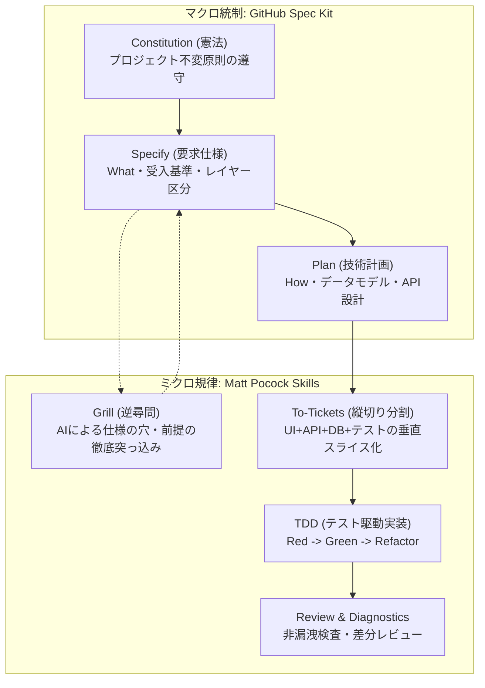
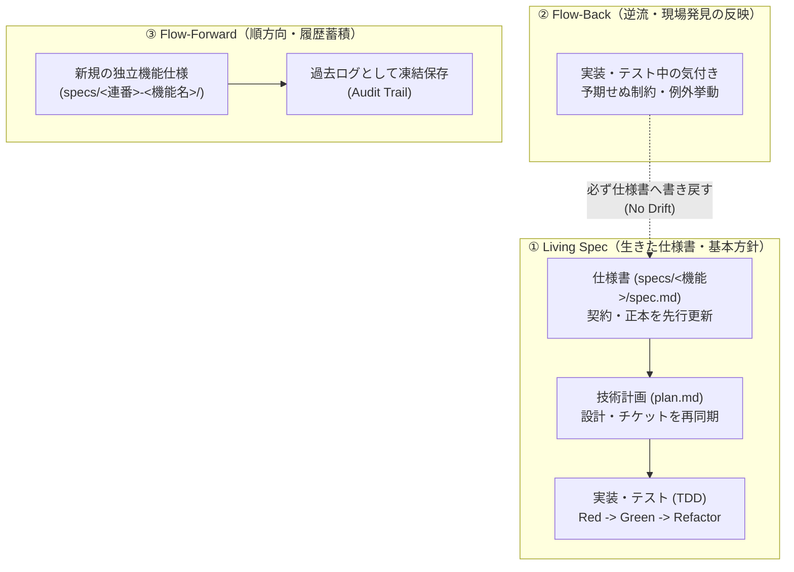

# 開発者向け仕様書駆動開発（SDD）運用ガイド

> **対象**: 本リポジトリ（`enishio-assessment-prototype`）で機能追加・改修・検証を行うすべての開発者（人間）  
> **使用ツール**: **GitHub Spec Kit**（仕様・構造の統制） × **Matt Pocock Skills**（対話・TDD・縦切り分割）

---

## 1. なぜ仕様書駆動開発（SDD）を行うのか？

プロトタイプ開発では、AIを使ってコードを一気に生成する「Vibe Coding」に頼ると、**「何が実稼働で何がモックか分からない」「コードと設計が乖離する」「正答鍵が画面に漏れる」**といったブラックボックス化が発生します。

本リポジトリでは、以下のハイブリッド分担により**「仕様を唯一の正本（Single Source of Truth）とし、AIを制御下で動かす開発規律」**を採用しています。



* **GitHub Spec Kit の役割（骨格）**: 仕様書や計画書のフォーマット標準化、プロジェクト憲法（`constitution.md`）の維持。
* **Matt Pocock Skills の役割（エンジン）**: 仕様の穴を突くAIの逆質問（Grill）、垂直スライス（縦切り）チケット分割、TDD（テスト先行）。

---

## 2. SDD 開発サイクルの全体手順

新機能の追加や改修を行う際は、以下の **5つのステップ** でAIと協働します。

```
Step 1: 仕様策定 (Spec)
   │
   ▼
Step 2: 逆質問による穴埋め (Grill)
   │
   ▼
Step 3: 技術計画 & 縦切りチケット分割 (Plan & Tickets)
   │
   ▼
Step 4: テスト駆動実装 (TDD Implementation)
   │
   ▼
Step 5: 検証ゲート通過 (Verification Gate)
```

---

## 3. 既存機能の進化・仕様維持（Living Spec ガイド）

開発が進んだ既存プロジェクトで最も陥りやすい罠は、**「コードだけを修正し、仕様書が古いまま放置されて誰も信じられなくなる（Dead Spec化 / Spec Drift）」**ことです。
GitHub Spec Kit の設計指針（[Evolving Specs in Existing Projects](https://github.github.io/spec-kit/guides/evolving-specs.html)）に基づき、本リポジトリでは仕様書を一度書いて終わりの静的ドキュメントではなく、常に最新の振る舞いを表す唯一の契約（Single Source of Truth / Contract）として維持・更新し続ける **「Living Spec（生きた仕様書）」** 運用を徹底します。

### 3.1 3つの仕様永続化モデル（Spec Persistence Models）
要件の追加・変更や、実装中の気付き（Discovery）が生じた際は、以下の3つのモデルを用途に応じて使い分けます。



| モデル | 位置づけ・適用シーン | 運用の基本ルール |
| :--- | :--- | :--- |
| **Living Spec<br/>（生きた仕様書）** | **既存機能の改修・仕様変更（本プロジェクトの基本方針）**<br/>すでにある画面・API・評価エンジンの仕様を拡張・変更する場合。 | **Contract First（契約先行）**。<br/>コードを直接書き換えるのではなく、まず既存の仕様書（[specs/](file:///c:/Users/ryo/Desktop/enishio-business/products/enishio-assessment-prototype/specs) 配下の各機能 `spec.md`）を更新し、下流の計画・タスク・テストコードへ変更を伝播させます。 |
| **Flow-Back Spec<br/>（逆流・実装フィードバック）** | **実装・テスト中の技術的発見（Discovery）の反映**<br/>コードを書いて初めて判明した外部制約や境界値、エッジケース。 | **No Drift（乖離ゼロの規律）**。<br/>コードやタスクで得た知見を現場だけに留めず、必ず最上流の仕様書へ逆流反映（Flow-back）させ、常に「仕様書を読めば実態が分かる」状態を保ちます。 |
| **Flow-Forward Spec<br/>（順方向・履歴蓄積）** | **全く新しい独立した大機能の追加**<br/>過去の設計判断ログをそのまま監査・比較用として保存したい場合。 | **Historical Record（履歴保全）**。<br/>新しいフィーチャー仕様ディレクトリ（`specs/<連番>-<機能名>/`）を作成して開発を進め、古い仕様は当時のマイルストーン記録として保全します。 |

---

### 3.2 Living Spec による既存機能の改修サイクル（7つのステップ）
既存機能の振る舞いを変更・追加する際は、Spec Kit の標準改修フローに沿って以下の7ステップで進めます。

```
Step 1: クリーンなブランチの準備 (Clean Working Tree)
   │
   ▼
Step 2: 仕様書（Spec）の先行修正 (Contract First Revision)
   │
   ▼
Step 3: AI逆質問（Grill）による影響範囲の精査 (Grill & Impact Analysis)
   │
   ▼
Step 4: 計画・タスクの差分更新 (Update Plan & Tasks / Rationale Preservation)
   │
   ▼
Step 5: ギャップ検査 (Gap Analysis / Analyze)
   │
   ▼
Step 6: テスト駆動実装 (TDD Implementation)
   │
   ▼
Step 7: 収束・完了検証 (Convergence Gate)
```

1. **Clean Working Tree（クリーンな作業ブランチ）**:
   未コミットの差分がない状態、または専用の改修ブランチから着手します。「仕様差分」と「コード差分」をPRやGitログで明確に対比できるようにするためです。
2. **Contract First Revision（仕様書の先行更新）**:
   コードに手を触れる前に、対象の機能仕様書（`specs/<機能名>/spec.md`）を修正します。何がどう変わるのか（What）と受入基準を改定します。
3. **Grill & Impact Analysis（影響範囲・破壊的変更の精査）**:
   `/grill-me` を実行し、既存のデータモデルや画面フロー、そして憲法（[constitution.md](file:///c:/Users/ryo/Desktop/enishio-business/products/enishio-assessment-prototype/.specify/memory/constitution.md) の非漏洩原則など）への悪影響がないかをAIに厳しく検証させます。
4. **Update Plan & Tasks（計画・タスクの差分更新）**:
   更新された仕様に基づき、技術計画や垂直スライスチケットを更新します。
   > [!IMPORTANT]
   > **設計判断の継承（Preserve Rationale）**:
   > 計画書やタスクを再作成する際、過去に下した重要な技術選定やアーキテクチャ上の決定理由（なぜそのDB構造にしたのか等）を機械的に吹き飛ばしてはいけません。過去の判断意図を引き継いだ上で差分を追記します。
5. **Gap Analysis（ギャップ検査）**:
   実装に着手する前に、更新した「仕様」「計画」「タスク」「既存コード」の間に食い違いや未定義の箇所がないかを突合します。
6. **TDD Implementation（テスト駆動実装）**:
   チケットに沿って、失敗するテストの作成（Red）→ パスする最小限の実装（Green）→ リファクタリング（Refactor）を進めます。
7. **Convergence Gate（収束・完了検証）**:
   実装・テスト・仕様書が完全に同期したかを確認し、`npm run test`、`npm run build`、`npm run check:no-leak` をすべて通過させて完了とします。

---

### 3.3 実装中の気付きを仕様書に書き戻す「Flow-Back（逆流反映）」の鉄則
実装中やテスト中に、「外部APIのエラーレスポンス仕様が想定と違った」「このエッジケースではバリデーションエラーを明示すべきだった」といった発見（Discovery）が必ず発生します。

* **禁止事項**: コード側だけをアドホックに直して仕様書を放置すること（仕様書の陳腐化＝Spec Drift）。
* **実践ルール（Flow-Back）**:
  1. 現場（コードやテスト）で発見した技術的制約や例外挙動を特定する。
  2. それが仕様（振る舞い・受入基準）に影響を与える場合は、**即座に対象の仕様書へフィードバック（追記・更新）**する。
  3. コミットやPRは必ず「コードの変更」と「仕様書の更新」を1組にして行う。

---

## 4. コピペで使える「AIへの発注プロンプト集（チートシート）」

日常の開発でそのままAIチャット（Antigravity / Claude Code / Copilot 等）に入力できるプロンプト例です。

### 📋 シーン1: 新しい機能や画面を企画したいとき（Spec作成）
AIにいきなりコードを書かせず、まずは要求仕様書を作らせます。

```markdown
新機能「[機能名。例: 演習中のAI同僚モデル切り替え機能]」を開発したいです。
コードはまだ書かないでください。
`.specify/templates/spec-template.md` に基づいて、仕様案を `specs/[連番]-[機能名]/spec.md` に作成してください。
その際、本プロジェクト憲法（`.specify/memory/constitution.md`）を参照し、
「実稼働（Feasibility）」か「モック（Viability）」の区分と受入基準（Given-When-Then）を明確にしてください。
```

---

### 🔥 シーン2: 仕様の抜け漏れ・前提の穴をAIに突っ込ませたいとき（Grill）
AIが「イエスマン」になるのを防ぎ、エッジケースや矛盾を洗い出させます。

```markdown
/grill-me
作成した仕様書（specs/[機能名]/spec.md）について、私（開発者）を厳しく質問攻め（Grill）してください。
特に以下の観点で容赦なく突っ込んでください：
1. 異常系・エッジケース（タイムアウト、APIエラー、境界値）
2. 正答鍵や機密情報のクライアント非漏洩（Principle II）
3. 実稼働層とモック層の境界が曖昧になっていないか（Principle I）
合意できた回答内容は仕様書の「Grill記録欄」に追記してください。
```

---

### ✂️ シーン3: 技術計画を立て、縦切りチケットに分割したいとき（Plan & Tickets）
横切り（全UIを作ってから全APIを作る）ではなく、動く最小単位（垂直スライス）に分解させます。

```markdown
/to-tickets
仕様書（specs/[機能名]/spec.md）をもとに、`.specify/templates/plan-template.md` に従って技術実装計画を `specs/[機能名]/plan.md` に作成してください。
タスクは「UI + API + DB + テスト」が1組になった動く垂直スライス（Vertical Slice）チケットに分割し、`specs/[機能名]/tasks.md` に出力してください。
各チケットには必ず TDD の確認手順を含めてください。
```

---

### 🧪 シーン4: 1チケットずつ TDD で実装させたいとき（TDD Implement）
必ずテストを先に書かせ、最小限の実装でグリーンにさせます。

```markdown
/tdd
計画書（specs/[機能名]/plan.md）の「Ticket [番号]」の実装に着手してください。
以下の規律を厳守してください：
1. Red: まず失敗するテスト（Vitest または Playwright）を作成・実行し、失敗を確認する。
2. Green: テストをパスさせる最小限の実装コードを書く。
3. Refactor: 型安全性を高め、不要な重複を排除する。
4. フォールバック採点や正答鍵の漏洩コードを書かないこと。
完了したらテスト結果を報告してください。
```

---

### 🔍 シーン5: バグの調査・修正を依頼したいとき（Diagnosing Bugs）
推測で直させず、再現テストを作ってから修正させます。

```markdown
/diagnosing-bugs
以下の不具合が発生しています：
[エラー内容・再現手順・ログ]

コードを直接書き換える前に、原因の仮説を立て、不具合を確実に再現するテストコード（Vitest）を作成してください。
そのテストが失敗することを確認した上で、原因を特定して修正してください。
```

---

### 🔄 シーン6: 既存機能の仕様を変更・拡張したいとき（Living Spec 改修）
コードをいきなり弄らず、まず既存の仕様書（[specs/](file:///c:/Users/ryo/Desktop/enishio-business/products/enishio-assessment-prototype/specs)）を Contract First で更新させます。

```markdown
既存機能「[機能名。例: 001-session-orchestration]」の仕様を変更したいです。
まだコードは書き換えないでください。
対象の仕様書（specs/[機能名]/spec.md）について、以下の変更要件を反映した改修案を作成してください：
[変更・追加したい振る舞いや受入基準]

その際、過去の設計理由（Rationale）を勝手に削除せず差分として追記し、
既存の画面やデータモデルへの影響範囲を明確にしてください。
完了後、/grill-me で私に影響範囲の逆質問を行ってください。
```

---

### 🔙 シーン7: 実装中に判明した制約を仕様書に逆流反映させたいとき（Flow-Back 反映）
コード側で判明した技術制約やエッジケースを仕様書へフィードバックさせ、陳腐化（Spec Drift）を防ぎます。

```markdown
実装・テスト中に以下の技術的制約 / エッジケースが判明しました：
[判明した制約・外部APIのエラー挙動・考慮漏れ]

コードの修正に合わせて、対象の仕様書（specs/[機能名]/spec.md）および計画書を最新の実態へ同期（Flow-Back）させてください。
仕様書と実装の間に乖離が残らないよう、受入基準や境界条件の記述を更新してください。
```

---

### ⚖️ シーン8: 仕様・計画・コードの乖離がないか監査したいとき（Gap Analysis & 収束）
作業完了前に、仕様書・計画・タスク・コードが完全に同期しているか突合させます。

```markdown
/speckit.analyze
今回の改修に伴い、仕様書（specs/[機能名]/spec.md）、計画書（plan.md）、タスク（tasks.md）、および実際の実装コードを突き合わせ、以下の整合性（Gap Analysis）を検査してください：
1. 仕様書に定義された受入基準がすべてテストコード（Vitest / Playwright）で網羅されているか？
2. 仕様書に記載のない未合意のコードや暗黙の前提が紛れ込んでいないか？
3. 実装上の制約や変更点が仕様書に反映されず放置されていないか？
4. プロジェクト憲法（.specify/memory/constitution.md）の原則（非漏洩・2層分離・フォールバック禁止）に違反していないか？
```

---

## 5. プロトタイプ開発で絶対に守るべき4大防衛線

AIに指示を出す際、以下の4点は人間側でも必ず念頭に置いてください。

### 防衛線 1: 実稼働（Feasibility）とモック（Viability）を混同しない
* **実稼働（TDD対象）**: セッション開始、アンカー回答、対話ターン、CFF事前判定、AutoSCORE採点、フィードバック。
  → DBへの永続化、Zodバリデーション、厳格なテストが必須。
* **モック（軽量対象）**: 組織ダッシュボード、受講者カルテ、ベンチマークギャラリー。
  → 展示用UIなので、静的データバインドでシンプルに作る。過度なDB結合を求めない。

### 防衛線 2: 正答鍵をクライアントに渡さない（Non-Leakage）
* `src/data/*.server.ts`（仕込み不備・正常箇所の正答鍵）を `"use client"` コンポーネントから import してはならない。
* 実装後、必ず以下の検証コマンドを実行する:
  ```bash
  npm run build
  npm run check:no-leak
  ```

### 防衛線 3: フォールバック採点を絶対に書かせない
* LLM API が呼べない・失敗したときに「キーワード一致」などで点数を埋めさせてはならない。
* 採点できない場合は「エラーを返す」か「`pending_human`（人間レビュー待ち）」にするのが測定学的に正しい。

### 防衛線 4: 仕様とコードの乖離（Spec Drift）を放置しない
* コードの修正と仕様書の更新は、常に「1つのコミット / PR」でセットにして運用する。「コードを直して仕様書は後回し」は厳禁。
* AIが勝手に仕様書にない振る舞い（暗黙の仮定）をコードに埋め込むのを許さず、必ず仕様書側の受入基準を先に合意する。

---

## 6. 人間のレビュー・チェックポイント（合格基準）

AIから提案やコードが上がってきたとき、人間はここだけを確認すれば安全です。

| フェーズ | 人間がチェックすべき「合意・OKの基準」 |
| :--- | :--- |
| **Spec レビュー** | ・What（受講者に何が起きるか）が明確か？<br>・実稼働かモックかのラベルが付いているか？<br>・憲法（Constitution）の原則に反していないか？ |
| **Living Spec レビュー** | ・仕様書の変更理由と差分が明確か？<br>・過去の重要な設計判断（Rationale）が勝手に消去されず継承されているか？ |
| **Grill レビュー** | ・AIからの意地悪な質問（エッジケース・エラー時）に答え切れたか？<br>・未解決の前提が残っていないか？ |
| **Plan レビュー** | ・チケットが「動く小さな単位（垂直スライス）」になっているか？<br>・`prisma/schema.prisma` の無駄な変更が含まれていないか？ |
| **Code レビュー** | ・テストコードが同時に作られ、パスしているか（`npm run test`）？<br>・漏洩チェック（`npm run check:no-leak`）を通過しているか？ |
| **Flow-Back / 収束レビュー** | ・実装中の発見や例外処理が仕様書に書き戻されているか？<br>・仕様書・計画・コードの間に食い違い（Spec Drift）が残っていないか？ |

---

## 7. コマンド・スクリプト クイックリファレンス

### AI スラッシュコマンド（Skills & Spec Kit）
| コマンド | 用途 |
| :--- | :--- |
| `/speckit-specify` | 要件から新規の構造化仕様書を作成 |
| `/speckit.clarify` | 仕様書の曖昧な箇所や追加要件を対話的に明確化・改定 |
| `/speckit.analyze` | 仕様書・計画書・タスク・既存コード間の整合性・ギャップ検査 |
| `/speckit.converge` | 実装漏れの洗い出しと仕様・実装の完全収束（Convergence）検証 |
| `/grill-me` / `/grill-with-docs` | 仕様の穴・トレードオフ・影響範囲を徹底逆質問 |
| `/to-tickets` | 実装タスクを垂直スライスチケットへ分解 |
| `/tdd` | Red-Green-Refactor サイクルでテスト駆動実装 |
| `/diagnosing-bugs` | 再現テスト作成と根本原因の修正 |
| `/code-review` | 憲法や規約に沿った自動コードレビュー |

### プロジェクト検証スクリプト
```bash
# 単体・ロジックテストの実行
npm run test

# 型検査と本番ビルド
npm run build

# 正答鍵のクライアント漏洩検査（最重要）
npm run check:no-leak

# E2E画面遷移テスト（Headless Chrome）
npm run test:e2e
```
