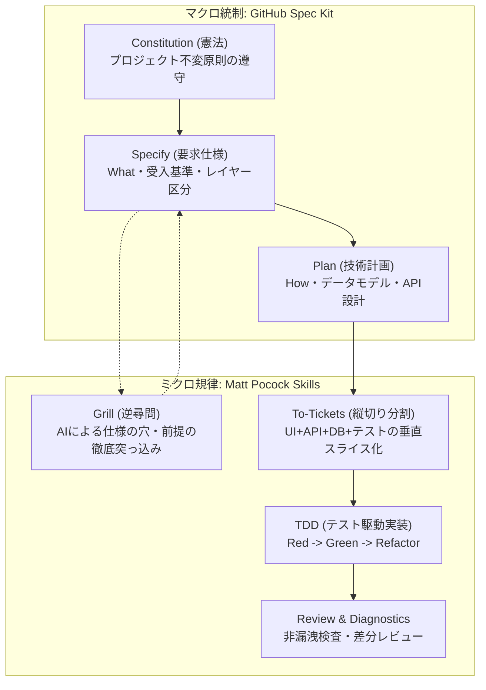

# 開発者向け仕様書駆動開発（SDD）運用ガイド

> **対象**: 本リポジトリ（`enishio-assessment-prototype`）で機能追加・改修・検証を行うすべての開発者（人間）  
> **使用ツール**: **GitHub Spec Kit**（仕様・構造の統制） × **Matt Pocock Skills**（対話・TDD・縦切り分割）

---

## 1. なぜ仕様書駆動開発（SDD）を行うのか？

プロトタイプ開発では、AIを使ってコードを一気に生成する「Vibe Coding」に頼ると、**「何が実稼働で何がモックか分からない」「コードと設計が乖離する」「正答鍵が画面に漏れる」**といったブラックボックス化が発生します。

本リポジトリでは、以下のハイブリッド分担により**「仕様を唯一の正本（Single Source of Truth）とし、AIを制御下で動かす開発規律」**を採用しています。



* **GitHub Spec Kit の役割（骨格）**: 仕様書や計画書のフォーマット標準化、プロジェクト憲法（`constitution.md`）の維持。
* **Matt Pocock Skills の役割（エンジン）**: 仕様の穴を突くAIの逆質問（Grill）、垂直スライス（縦切り）チケット分割、TDD（テスト先行）。

---

## 2. SDD 開発サイクルの全体手順

新機能の追加や改修を行う際は、以下の **5つのステップ** でAIと協働します。

```
Step 1: 仕様策定 (Spec)
   │
   ▼
Step 2: 逆質問による穴埋め (Grill)
   │
   ▼
Step 3: 技術計画 & 縦切りチケット分割 (Plan & Tickets)
   │
   ▼
Step 4: テスト駆動実装 (TDD Implementation)
   │
   ▼
Step 5: 検証ゲート通過 (Verification Gate)
```

---

## 3. コピペで使える「AIへの発注プロンプト集（チートシート）」

日常の開発でそのままAIチャット（Antigravity / Claude Code / Copilot 等）に入力できるプロンプト例です。

### 📋 シーン1: 新しい機能や画面を企画したいとき（Spec作成）
AIにいきなりコードを書かせず、まずは要求仕様書を作らせます。

```markdown
新機能「[機能名。例: 演習中のAI同僚モデル切り替え機能]」を開発したいです。
コードはまだ書かないでください。
`.specify/templates/spec-template.md` に基づいて、仕様案を `.specs/features/[機能名].md` に作成してください。
その際、本プロジェクト憲法（`.specify/memory/constitution.md`）を参照し、
「実稼働（Feasibility）」か「モック（Viability）」の区分と受入基準（Given-When-Then）を明確にしてください。
```

---

### 🔥 シーン2: 仕様の抜け漏れ・前提の穴をAIに突っ込ませたいとき（Grill）
AIが「イエスマン」になるのを防ぎ、エッジケースや矛盾を洗い出させます。

```markdown
/grill-me
作成した仕様書（.specs/features/[機能名].md）について、私（開発者）を厳しく質問攻め（Grill）してください。
特に以下の観点で容赦なく突っ込んでください：
1. 異常系・エッジケース（タイムアウト、APIエラー、境界値）
2. 正答鍵や機密情報のクライアント非漏洩（Principle II）
3. 実稼働層とモック層の境界が曖昧になっていないか（Principle I）
合意できた回答内容は仕様書の「Grill記録欄」に追記してください。
```

---

### ✂️ シーン3: 技術計画を立て、縦切りチケットに分割したいとき（Plan & Tickets）
横切り（全UIを作ってから全APIを作る）ではなく、動く最小単位（垂直スライス）に分解させます。

```markdown
/to-tickets
仕様書（.specs/features/[機能名].md）をもとに、`.specify/templates/plan-template.md` に従って技術実装計画を作成してください。
タスクは「UI + API + DB + テスト」が1組になった動く垂直スライス（Vertical Slice）チケットに分割してください。
各チケットには必ず TDD の確認手順を含めてください。
```

---

### 🧪 シーン4: 1チケットずつ TDD で実装させたいとき（TDD Implement）
必ずテストを先に書かせ、最小限の実装でグリーンにさせます。

```markdown
/tdd
計画書の「Ticket [番号]」の実装に着手してください。
以下の規律を厳守してください：
1. Red: まず失敗するテスト（Vitest または Playwright）を作成・実行し、失敗を確認する。
2. Green: テストをパスさせる最小限の実装コードを書く。
3. Refactor: 型安全性を高め、不要な重複を排除する。
4. フォールバック採点や正答鍵の漏洩コードを書かないこと。
完了したらテスト結果を報告してください。
```

---

### 🔍 シーン5: バグの調査・修正を依頼したいとき（Diagnosing Bugs）
推測で直させず、再現テストを作ってから修正させます。

```markdown
/diagnosing-bugs
以下の不具合が発生しています：
[エラー内容・再現手順・ログ]

コードを直接書き換える前に、原因の仮説を立て、不具合を確実に再現するテストコード（Vitest）を作成してください。
そのテストが失敗することを確認した上で、原因を特定して修正してください。
```

---

## 4. プロトタイプ開発で絶対に守るべき3大防衛線

AIに指示を出す際、以下の3点は人間側でも必ず念頭に置いてください。

### 防衛線 1: 実稼働（Feasibility）とモック（Viability）を混同しない
* **実稼働（TDD対象）**: セッション開始、アンカー回答、対話ターン、CFF事前判定、AutoSCORE採点、フィードバック。
  → DBへの永続化、Zodバリデーション、厳格なテストが必須。
* **モック（軽量対象）**: 組織ダッシュボード、受講者カルテ、ベンチマークギャラリー。
  → 展示用UIなので、静的データバインドでシンプルに作る。過度なDB結合を求めない。

### 防衛線 2: 正答鍵をクライアントに渡さない（Non-Leakage）
* `src/data/*.server.ts`（仕込み不備・正常箇所の正答鍵）を `"use client"` コンポーネントから import してはならない。
* 実装後、必ず以下の検証コマンドを実行する:
  ```bash
  npm run build
  npm run check:no-leak
  ```

### 防衛線 3: フォールバック採点を絶対に書かせない
* LLM API が呼べない・失敗したときに「キーワード一致」などで点数を埋めさせてはならない。
* 採点できない場合は「エラーを返す」か「`pending_human`（人間レビュー待ち）」にするのが測定学的に正しい。

---

## 5. 人間のレビュー・チェックポイント（合格基準）

AIから提案やコードが上がってきたとき、人間はここだけを確認すれば安全です。

| フェーズ | 人間がチェックすべき「合意・OKの基準」 |
| :--- | :--- |
| **Spec レビュー** | ・What（受講者に何が起きるか）が明確か？<br>・実稼働かモックかのラベルが付いているか？<br>・憲法（Constitution）の原則に反していないか？ |
| **Grill レビュー** | ・AIからの意地悪な質問（エッジケース・エラー時）に答え切れたか？<br>・未解決の前提が残っていないか？ |
| **Plan レビュー** | ・チケットが「動く小さな単位（垂直スライス）」になっているか？<br>・`prisma/schema.prisma` の無駄な変更が含まれていないか？ |
| **Code レビュー** | ・テストコードが同時に作られ、パスしているか（`npm run test`）？<br>・漏洩チェック（`npm run check:no-leak`）を通過しているか？ |

---

## 6. コマンド・スクリプト クイックリファレンス

### AI スラッシュコマンド（Skills）
| コマンド | 用途 |
| :--- | :--- |
| `/speckit-specify` | 要件から構造化仕様書を作成 |
| `/grill-me` / `/grill-with-docs` | 仕様の穴・トレードオフを徹底逆質問 |
| `/to-tickets` | 実装タスクを垂直スライスチケットへ分解 |
| `/tdd` | Red-Green-Refactor サイクルでテスト駆動実装 |
| `/diagnosing-bugs` | 再現テスト作成と根本原因の修正 |
| `/code-review` | 憲法や規約に沿った自動コードレビュー |

### プロジェクト検証スクリプト
```bash
# 単体・ロジックテストの実行
npm run test

# 型検査と本番ビルド
npm run build

# 正答鍵のクライアント漏洩検査（最重要）
npm run check:no-leak

# E2E画面遷移テスト（Headless Chrome）
npm run test:e2e
```
