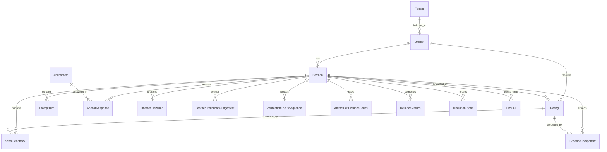

# Enishio Assessment Prototype Specifications

本ディレクトリは、GitHub Spec Kit の公式標準仕様に準拠した仕様書正本（Single Source of Truth）管理ディレクトリです。

システム全体の機能・データモデル・API契約は、各ドメインを担当するフィーチャーディレクトリ（`specs/<連番>-<名前>/`）内に完全に集約・一本化されています。

---

## 1. システム全体構成 (System Architecture)

受講者が生成AIと対話しながら実務課題を解決するプロセスから、「動的コンピテンシー（AI協働検証力・トレードオフ言語化力）」を客観的に抽出・測定するWebプラットフォームです。

```
┌────────────────────────────────────────────────────────────────────────┐
│                          Next.js App Router                            │
│  ┌─────────────────────────────┐    ┌───────────────────────────────┐  │
│  │   UI Layer ("use client")   │    │   API Layer (Route Handlers)  │  │
│  │  - Session Orchestration    │    │  - Session & Telemetry        │  │
│  │  - 3-Pane Dynamic Dialogue  │───>│  - Dynamic Task & Flaws (Svr) │  │
│  │  - Viability Mocks          │    │  - 2-Stage AutoSCORE          │  │
│  └─────────────────────────────┘    │  - Socratic Mediator          │  │
│                                     └──────────────┬────────────────┘  │
└────────────────────────────────────────────────────┼───────────────────┘
                                                     │
                             ┌───────────────────────┴───────────────────────┐
                             │                                               │
                             ▼                                               ▼
               ┌───────────────────────────┐                   ┌───────────────────────────┐
               │    PostgreSQL Database    │                   │   OpenAI API (GPT-5/4o)   │
               │  - 16 Prisma Models       │                   │  - Stage 1: Evidence Ext. │
               │  - Telemetry & Logs       │                   │  - Stage 2: Band Scoring  │
               │  - Audit Trails           │                   │  - Socratic Probe Move    │
               └───────────────────────────┘                   └───────────────────────────┘
```

---

## 2. 全体データモデル ER図 (Prisma 16 Models)

全16モデルは各フィーチャーによって正本管理され、外部キー制約によって以下の通り結合されています。



---

## 3. フィーチャー仕様正本一覧 (`<prefix>-<short-name>/`)

各フィーチャーディレクトリが、担当ドメインの要件（`spec.md`）、技術設計・DBモデル・API契約（`plan.md`）、および実装タスク（`tasks.md`）の唯一の正本です。

### [001-session-orchestration](001-session-orchestration/)
* **責務**: 演習セッション全体のライフサイクル統制、受講者識別、回答・発話・行動テレメトリの収集、および画面レイヤー管理。
* **管理する DB モデル (10モデル)**: `Tenant`, `Learner`, `Session`, `AnchorItem`, `AnchorResponse`, `PromptTurn`, `LearnerPreliminaryJudgement`, `VerificationFocusSequence`, `ArtifactEditDistanceSeries`, `ScoreFeedback`
* **管理する API エンドポイント (8本)**: `/api/session/start`, `/api/session/blur`, `/api/anchor` (GET/POST), `/api/dialogue/start`, `/api/dialogue/turn`, `/api/dialogue/focus`, `/api/dialogue/preliminary-judgement`, `/api/feedback`
* **ドキュメント**: [spec.md](001-session-orchestration/spec.md) / [plan.md](001-session-orchestration/plan.md) / [tasks.md](001-session-orchestration/tasks.md)

### [002-autoscore-pipeline](002-autoscore-pipeline/)
* **責務**: AutoSCORE 2段階採点エンジン、客観的根拠要素抽出、ルーブリック規準評定、適正依存3指標算出、HITL閾値判定、および LLM 呼出監査。
* **管理する DB モデル (4モデル)**: `Rating`, `EvidenceComponent`, `RelianceMetrics`, `LlmCall`
* **管理する API エンドポイント (1本)**: `/api/dialogue/evaluate`
* **ドキュメント**: [spec.md](002-autoscore-pipeline/spec.md) / [plan.md](002-autoscore-pipeline/plan.md) / [tasks.md](002-autoscore-pipeline/tasks.md)

### [003-socratic-mediator](003-socratic-mediator/)
* **責務**: ソクラテス型問いかけ（プローブ）自律生成、正答鍵完全遮断、5つの状態推定、および場面3前提変化（緊急仕様変更）の動的注入。
* **管理する DB モデル (2モデル)**: `MediationProbe`, `InjectedFlawMap`
* **管理する API エンドポイント (2本)**: `/api/dialogue/probe`, `/api/dialogue/premise-shift`
* **ドキュメント**: [spec.md](003-socratic-mediator/spec.md) / [plan.md](003-socratic-mediator/plan.md) / [tasks.md](003-socratic-mediator/tasks.md)

---

## 4. 運用ルール (Spec Kit Living Spec サイクル)

1. **新規機能の追加**: `/speckit-specify` またはテンプレート（`.specify/templates/spec-template.md`）を用いて `specs/<連番>-<機能名>/` を作成。
2. **既存機能の改修（Living Spec）**: コードを触る前にまず対象の `spec.md` / `plan.md` を更新し、`/speckit.plan` → `/to-tickets` → `/tdd` で実装へ波及させる。
3. **現場発見の逆流反映（Flow-Back）**: 実装中に判明した制約は必ず対象フィーチャーの仕様書へ書き戻す。
