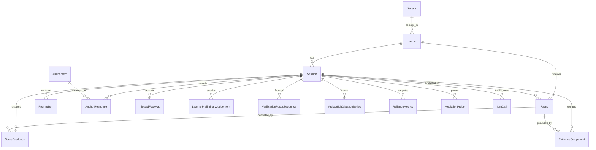

# Enishio Assessment Prototype Specifications

本ディレクトリは、GitHub Spec Kit の公式標準仕様に準拠した仕様書正本（Single Source of Truth）管理ディレクトリです。

システム全体の機能・データモデル・API契約は、各ドメインを担当するフィーチャーディレクトリ（`specs/<連番>-<名前>/`）内に完全に集約・一本化されています。

---

## 1. システム全体構成 (System Architecture)

受講者が生成AIと対話しながら実務課題を解決するプロセスから、「AI時代の実務判断力（AI協働検証力・トレードオフ言語化力）」を客観的に抽出・測定するWebプラットフォームです。

```
┌────────────────────────────────────────────────────────────────────────┐
│                          Next.js App Router                            │
│  ┌─────────────────────────────┐    ┌───────────────────────────────┐  │
│  │   UI Layer ("use client")   │    │   API Layer (Route Handlers)  │  │
│  │  - Session Orchestration    │    │  - Session & Telemetry        │  │
│  │  - 2-Pane Dynamic Dialogue  │───>│  - Dynamic Task & Flaws (Svr) │  │
│  │  - Viability Mocks          │    │  - 構造化採点パイプライン (2-Stage) │  │
│  └─────────────────────────────┘    │  - Socratic Mediator          │  │
│                                     └──────────────┬────────────────┘  │
└────────────────────────────────────────────────────┼───────────────────┘
                                                     │
                             ┌───────────────────────┴───────────────────────┐
                             │                                               │
                             ▼                                               ▼
               ┌───────────────────────────┐                   ┌───────────────────────────┐
               │    PostgreSQL Database    │                   │   OpenAI API (GPT-5/4o)   │
               │  - 16 Prisma Models       │                   │  - Stage 1: Evidence Ext. │
               │  - Telemetry & Logs       │                   │  - Stage 2: Band Scoring  │
               │  - Audit Trails           │                   │  - Socratic Probe Move    │
               └───────────────────────────┘                   └───────────────────────────┘
```

---

## 2. 全体データモデル ER図 (Prisma 16 Models)

全16モデルは各フィーチャーによって正本管理され、外部キー制約によって以下の通り結合されています。



---

## 3. フィーチャー仕様正本一覧 (`<prefix>-<short-name>/`)

各フィーチャーディレクトリが、担当ドメインの要件（`spec.md`）、技術設計・DBモデル・API契約（`plan.md`）、および実装タスク（`tasks.md`）の唯一の正本です。

### [001-session-orchestration](001-session-orchestration/)
* **責務**: 演習セッション全体のライフサイクル統制、受講者識別、回答・発話・行動テレメトリの収集、および画面レイヤー管理。
* **管理する DB モデル (10モデル)**: `Tenant`, `Learner`, `Session`, `AnchorItem`, `AnchorResponse`, `PromptTurn`, `LearnerPreliminaryJudgement`, `VerificationFocusSequence`, `ArtifactEditDistanceSeries`, `ScoreFeedback`
* **管理する API エンドポイント (8本)**: `/api/session/start`, `/api/session/blur`, `/api/anchor` (GET/POST), `/api/dialogue/start`, `/api/dialogue/turn`, `/api/dialogue/focus`, `/api/dialogue/preliminary-judgement`, `/api/feedback`
* **ドキュメント**: [spec.md](001-session-orchestration/spec.md) / [plan.md](001-session-orchestration/plan.md) / [tasks.md](001-session-orchestration/tasks.md)

### [002-structured-scoring-pipeline](002-structured-scoring-pipeline/)
* **責務**: 構造化採点パイプライン（2段階採点エンジン）、客観的根拠要素抽出、ルーブリック規準評定、適正依存3指標算出、HITL閾値判定、および LLM 呼出監査。
* **管理する DB モデル (4モデル)**: `Rating`, `EvidenceComponent`, `RelianceMetrics`, `LlmCall`
* **管理する API エンドポイント (1本)**: `/api/dialogue/evaluate`
* **ドキュメント**: [spec.md](002-structured-scoring-pipeline/spec.md) / [plan.md](002-structured-scoring-pipeline/plan.md) / [tasks.md](002-structured-scoring-pipeline/tasks.md)

### [003-socratic-mediator](003-socratic-mediator/)
* **責務**: ソクラテス型問いかけ（プローブ）自律生成、正答鍵完全遮断、5つの状態推定、および場面3前提変化（緊急仕様変更）の動的注入。
* **管理する DB モデル (2モデル)**: `MediationProbe`, `InjectedFlawMap`
* **管理する API エンドポイント (2本)**: `/api/dialogue/probe`, `/api/dialogue/premise-shift`
* **ドキュメント**: [spec.md](003-socratic-mediator/spec.md) / [plan.md](003-socratic-mediator/plan.md) / [tasks.md](003-socratic-mediator/tasks.md)

### [004-equating-simulation](004-equating-simulation/)
* **責務**: 共通尺度化エンジン（第1層：一対比較＋Bradley-Terry、第2層：固定設問・凍結ペアによる定点較正）の合成データ検証。本番の採点経路・DB には接続しない。
* **管理する DB モデル**: なし
* **管理する API エンドポイント**: なし（`npm run sim:equating` で実行）
* **ドキュメント**: [spec.md](004-equating-simulation/spec.md) ／ 結果: [docs/equating-simulation/](../docs/equating-simulation/README.md)

---

## 4. 専門用語の定義 (Domain Terminology)

* **AI時代の実務判断力（4領域）**（旧称：動的コンピテンシー）:
  曖昧な要求を構造化し、前提変化に適応しながら、AIを統制・検証して最適解を導く能力。**① 評価的判断力／② 高次認知・動的思考／③ 対話的共創力／④ メタ認知・適応力**の4領域に整理して観測する。
* **等化（Equating）**:
  別々の課題を受けた受講者の評点を、同じものさしの上に載せて比較できるようにすること。対話演習は受講者ごとに課題も会話も分岐するため、評点をそのまま並べても「実力差なのか難易度差なのか」を切り分けられない。
* **共通アンカー（固定設問）**:
  全員が同一条件で答える固定の設問。LLMを通さず、専門家の回答分布から事前に定めた計算式だけで採点するため、**対話側の数値が動いたときに「受講者が動いたのか、採点器が動いたのか」を切り分ける定点**として機能する。本プロトタイプでは出題から無得点記録までの経路を実装している。
* **SCT（Script Concordance Test）**:
  正解が1つに定まらない状況で、新しい情報が与えられたときに判断がどちらへどれだけ動くかを測る形式。医学教育の臨床推論評価で確立されている。共通アンカーはこれを段階1〜3' の4段構成としてIT向けに応用したものである。
* **構造化採点パイプライン（2段階採点）と証拠**:
  1回のプロンプトでLLMに点数を出させず、**① 対話ログから受講者の検証行動を「証拠」として抽出する** → **② その証拠だけを入力にルーブリックで判定する**、の2段に分ける。根拠と得点の対応がログ上で追跡でき（`evidence_components`）、第2段階のプロンプトに生ログと正答鍵が渡っていないことは回帰テストで固定している。
* **一対比較（Comparative Judgement）と Bradley-Terry**:
  絶対点を付ける代わりに、2人分の証拠を突き合わせて「どちらがより優れた判断を示しているか」を判定し、その勝敗成績から潜在能力値を推定する統計モデル。課題ごとの難易度を事前に測らずに、異なる課題を経た受講者を1本の尺度に載せられる。本プロトタイプでは判定器そのものは未実装で、比較対象を永続化する経路までを用意している。
* **CFF（認知強制機能 / Force Decision First & Mandatory Justification）**:
  AIの採点結果を開示する前に、受講者自身に［承認］［条件付き承認］［修正要求］の判定と理由を確定させる仕組み。AI出力への追従を防ぎ、受講者自身の判断を採点対象として確保する。
* **セッション内の前提変化**:
  レビューの途中で、クライアントからの緊急仕様変更を注入する仕掛け。当初方針に固執せず方針を更新できるか（メタ認知・適応力）を実測する。**発火は進行役側（`/api/dialogue/premise-shift`）が対話ログだけを見て決定論的に判定し、受講者は撃つ時点を選べない** `[D-100]`。
* **バンド（0〜5）と `pending_human`**:
  バンドはAI時代の実務判断力のルーブリック上の到達水準。採点器が自己申告した確信度が 0.70 を下回る判定は確定させず、`rating_category = null` ・ `rater_type = "pending_human"`（人間の確認待ち）として記録する。
* **XAI評価レポート**:
  判定の根拠となった発言箇所のハイライト、4領域の観測サマリー、受講者の事前判定との対照、異議申立導線までを含む診断画面。

---

## 5. 検証・テストアーキテクチャ (Verification & Test Invariants)

### 5.1 単体テストが押さえている不変条件 (Vitest 261件)

憲法（`constitution.md`）および各フィーチャー仕様のうち、**壊れたら測定や監査が成立しなくなる不変条件を回帰テストとして固定**している。LLM 呼び出しはモックされているため、APIキーもDBも不要で即座に走る。

| 対象モジュール / テスト | 押さえている不変条件・憲法準拠 |
| :--- | :--- |
| `src/lib/evaluator/index.test.ts` | **第2段階のプロンプトに対話ログの生テキストと正答鍵の本文が渡っていない**（2段階分離・Principle III）。採点不能時に推測値を返さず `ScoringUnavailableError` になる（フォールバック禁止）。バンド・確信度が範囲外の出力を弾く。`scorer_model_version` が実際に使ったモデルと一致する。 |
| `src/app/api/dialogue/evaluate/route.test.ts` | 確信度が**閾値ちょうど（0.70）なら確定し、下回ったときだけ `pending_human`** になる。保留時もモデルの自己申告確信度は改変せず記録する。`learner_id` / `session_seq` をリクエストボディから採らない。採点失敗時に評点を1行も作らない。 |
| `src/lib/telemetry/reliance-metrics.test.ts` | 適正依存3指標（CSR / ABI / CAR）の算出。**分母が0のときは 0 ではなく null**（「該当箇所が無かった」と「1件も正しく扱えなかった」を潰さない）。仕込み不備への過剰指摘を正常箇所の過剰指摘として誤算しない。 |
| `src/lib/mediator/index.test.ts` | **媒介へ正答鍵を渡さない**（Principle III）——プロンプトに仕込み不備の位置・説明が含まれず、モジュール自体が `dynamic-task.server` を import していない。打てる手の定義とシステムプロンプトがずれない。 |
| `src/app/api/dialogue/probe/route.test.ts` | 深掘りの上限（4手）と、`none`（問わない）を手数に数えないこと。**「問わない」と判断した事実も記録するが対話ログには流さない。**問いは `mediator` ロールで残す（AI同僚と混ぜない）。 |
| `src/app/api/anchor/route.test.ts` | **採点鍵（`correct_key` / `hidden_premise` / 専門家パネル分布 / `item_kind` / 各種 note）がレスポンスに1つも載らない**（Principle II）。段階2の提示順を応答と一緒に返す。段階3の回答 `0`（＝動かなかった）を未回答として弾かない。 |
| `src/lib/anchor-bank.test.ts` | 同梱サンプルが v2-sct として読め、正答が1キーに固定されていない。類型C（不備なし）が混ざっている。 |
| `src/lib/telemetry/index.test.ts` | `ratings` の記録前バリデーション（アンカーの `anchor_id` / `anchor_status` 必須、バンド範囲、`rating_category = null` は `pending_human` のときだけ）。異議申立の理由必須、CFF の判断理由必須。 |
| `src/lib/edit-distance.test.ts` | 編集距離（日本語を含む）と長大入力のフォールバック。 |

### 5.2 結合テスト（実PostgreSQL・`npm run test:integration`）

単体テストはDBをモックし、E2EはAPIルートをモックしているため、**「サーバコードが実際にDBへ正しく書けているか」を通しで検証する層**として `src/integration/vertical-slice.integration.test.ts`（20件）を配置している。

```
セッション開始 → 課題開始（仕込み不備の確定）→ 対話1往復 → ソクラテス型深掘り
→ 検証箇所の記録 → 画面外滞在時間 → CFF事前判断 → 構造化採点パイプライン → 異議申立 → アンカー応答
```

* `sessions` の `(learner_id, session_seq)` 一意制約と採番リトライ（5本同時に開始しても連番になることを実DBで検証）
* `ratings.rating_category` が nullable で `pending_human` の行が保存できること
* `anchor_responses` の `(session_id, anchor_id)` 一意制約による二重回答防止
* `evidence_components` / `reliance_metrics` が同一 `rating_id` / セッションへ紐づくこと
* 外部キー（`anchor_responses → anchor_items`）が未投入の項目を弾くこと

---

## 6. 運用ルール (Spec Kit Living Spec サイクル)

1. **新規機能の追加**: `/speckit-specify` またはテンプレート（`.specify/templates/spec-template.md`）を用いて `specs/<連番>-<機能名>/` を作成。
2. **既存機能の改修（Living Spec）**: コードを触る前にまず対象の `spec.md` / `plan.md` を更新し、`/speckit.plan` → `/to-tickets` → `/tdd` で実装へ波及させる。
3. **現場発見の逆流反映（Flow-Back）**: 実装中に判明した制約は必ず対象フィーチャーの仕様書へ書き戻す。
